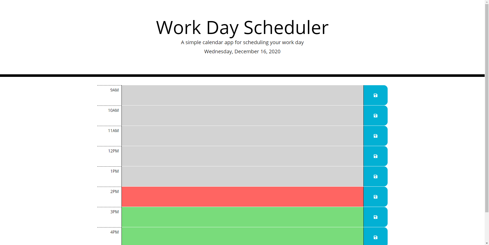

# Work Day Scheduler (Homework-05)

## Description

This web page allows the user to enter and save an hourly work schedule for 9-5. The webpage layout uses Bootstrap, and the interactive elements are written in jQuery. I was given most of the CSS, but I did make some changes to make the styling function the way I wanted.

[Deployed here on Github Pages](https://johndjake.github.io/work-day-scheduler/)

## Usage

Enter text describing your scheduled events for the hour on each line. Press the save button to save that line. Note - each save button only saves the line it is on, it will not save changes made on other lines.

## Credits

* The webpage styling was given to me by Trilogy Education Services as a homework assignment.
* Made with [Bootstrap](https://getbootstrap.com).
* Made with [jQuery](https://jquery.com/).

## License

The design of this webpage is copyrighted by Trilogy Education Services.